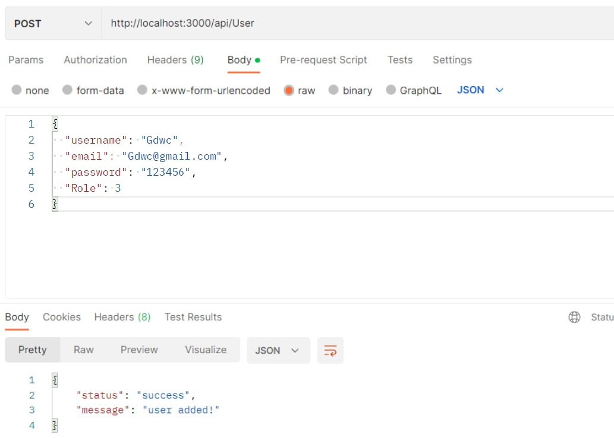
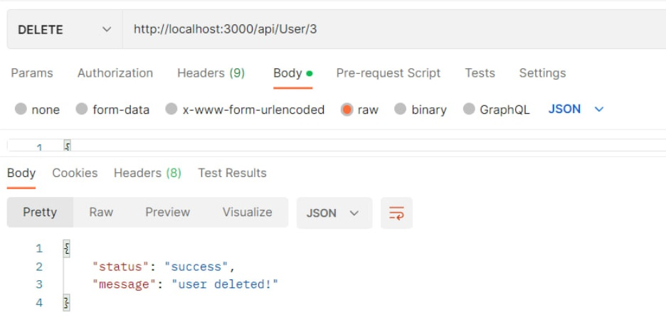
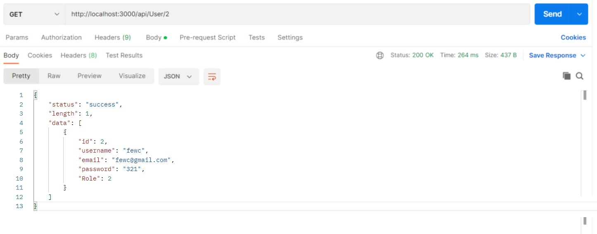

# Тестування працездатності системи

*В цьому розділі необхідно вказати засоби тестування, навести вихідні коди тестів та результати тестування.*
## Створення користувача

## Редагування користувача за id

## Видалення користувача

## Відобразити користувача за id

